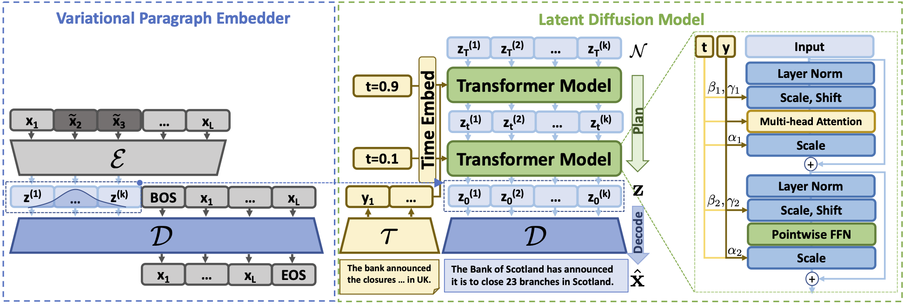
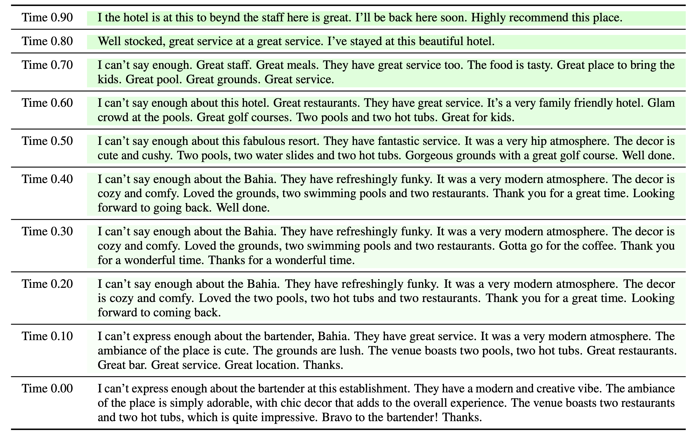
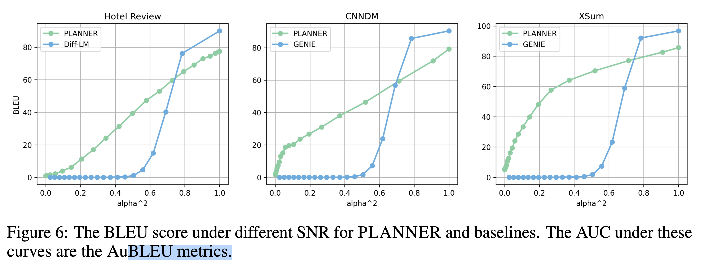

# PLANNER: a latent text diffusion model

This software project accompanies the research paper, [PLANNER: Generating Diversified Paragraph via Latent Language Diffusion Model](https://arxiv.org/pdf/2306.02531.pdf), published on NeurIPS 2023. 


<p align = "center">

</p>

## Highlights
- **PLANNER** is a latent text diffusion model that effectively generates text by utilizing both latent semantic diffusion and autoregressive generation. 
- This is accomplished by integrating an ***autoregressive decoder*** for "*decoding*" with a ***latent diffusion module*** for "*planning*" to produce paragraph in a coarse-to-fine manner. 
<p align = "center">

</p>
- **PLANNER** is capable of generating long-form text in an efficient manner.
- **PLANNER** propose a novel AuBLEU metric (AuBL) to evaluate Denoising Capability across different text diffusion models.
<p align = "center">

</p>

## Setup
Please generally follow the setup command in below. 
```bash 
bash setup.sh
```
## Create dataset

This step involves tokenizing the dataset in a specified folder that contains ``.json`` files, and then saving it into a folder `parsed_raw_pre` containing three ``.pt`` files of train, dev and test. 

```bash 
python text_autoencoder/prepro.py --corpus data-bin/dummy_data
```


## Train a variational paragraph embedder

See examples for training a variational paragraph embedder in below. 

```bash 
bash ./bash/ae/run_ae.sh
```

### Key Arguments in the `/autoencoder/train.py` Script:

#### Data and Training Parameters:

- `--seed`: Seed for random number generation.
- `--lr`, `--enc_lr`, `--dec_lr`: Initial learning rates for the overall model, encoder, and decoder, respectively.
- `--epochs`: Number of training epochs.
- `--batch_size`: Batch size for training.
- `--valid_size`: Size of the validation set.
- `--lr_decay_interval`: Interval (in epochs) for learning rate decay.
- `--dropout`: Dropout ratio to prevent overfitting.
- `--gradient_accumulation_steps`: Number of steps for gradient accumulation.

#### Model Architecture and Configuration:

- `--enc_model`: Encoder model to be used (`bert-large-uncased`, `google/flan-t5-xl`, etc.).
- `--dec_model`: Decoder model (`gpt2-medium`, `gpt2-large`, etc.).
- `--latent_size`: Size of the latent variable.
- `--n_head`: Size of the attention head.
- `--num_layer`: Number of layers in the model.

#### File Paths and Saving:

- `--save_dir`: Directory path where model snapshots are saved.
- `--train_pt_dir`, `--dev_pt_dir`: Paths for training and development data.
- `--resume_ckpt`: Path to resume training from a specific checkpoint.
- `--exp_name`: Name of the experiment.

#### Other Model Configuration Options:

- `--out_layer`: Last layer choice for deconvolution (`pred_token`, `pred_emb`, `lm_head`).
- `--reg_layer`: Regularization layer (`bn`, `ln`, `none`).
- `--embed_dim`: Number of embedding dimensions.
- `--filter_size`: Filter size for convolution.
- `--filter_shape`: Shape of the filter to use for convolution.
- `--tau`: Temperature parameter for training.
- `--noiser`, `--noiser_ratio`: Noise type and ratio for data corruption.
- `--h_noiser`, `--h_noiser_ratio`: Hidden noise type and ratio.

#### Distributed Training Configuration:

- `--world_size`: Total number of distributed processes.
- `--gpus`: Number of GPUs to use.


## Create seq2seq dataset

Again, ``.pt`` files of train, dev and test need to be created for the (source, target) dataset. For example, for creating a dataset for summarization. First concatenate the document and summary into single tsv files by
```bash 
cd data-bin/dummy_sum_data
for file in *.document; do
    base=$(basename "$file" .document)
    if [[ -e "$base.summary" ]]; then
        paste "$base.document" "$base.summary" > "$base.txt"
    fi
done
cd -
```
Then run the following command:

```bash 
python text_autoencoder/prepro_ground.py --corpus ./data-bin/dummy_sum_data/
```
This will create three folders (``train``,``dev``,``test``) under ``data-bin/dummy_sum_data/parsed_raw_pre``.


## Train a latent semantic diffusion model
```bash 
bash ./bash/diffusion/run_diffusion.sh
```

## Inference & Evaluation
```bash 
bash ./bash/diffusion/pipeline_cond_gen.sh
```


## Citation
Please consider citing [our work](https://arxiv.org/pdf/2306.02531.pdf) if it is helpful to your research.
```
@inproceedings{zhang2023planner,
  title={PLANNER: Generating Diversified Paragraph via Latent Language Diffusion Model},
  author={Zhang, Yizhe and Gu, Jiatao and Wu, Zhuofeng and Zhai, Shuangfei and Susskind, Josh and Jaitly, Navdeep},
  booktitle = {NeurIPS},
  year={2023}
}
```

## Poster
<p align = "center">

</p>
<p align = "center">
**PLANNER** poster for NeurIPS 2023.
</p>